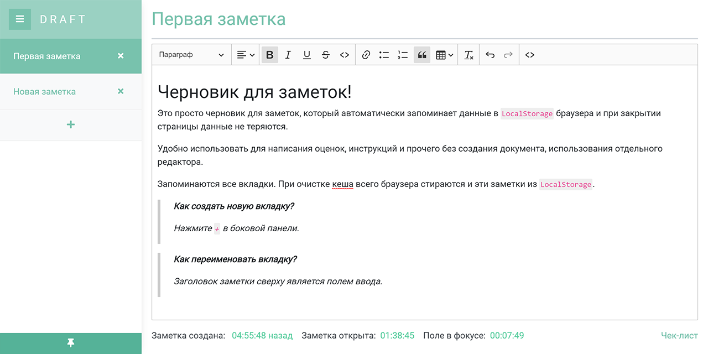

# 📄 Draft 
## Черновик для заметок!

Это просто черновик для заметок, который автоматически запоминает данные в LocalStorage браузера и при закрытии страницы данные не теряются.

Удобно использовать для написания оценок, инструкций и прочего без создания документа, использования отдельного редактора.

Запоминаются все вкладки. При очистке кеша всего браузера стираются и эти заметки из LocalStorage.
